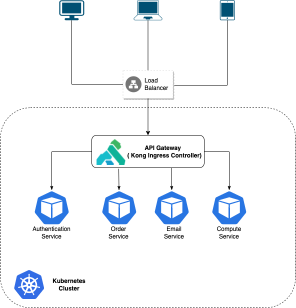

## Describe your idea to monitor the response time of a web application.

To measure web application response time, we can use a few potential metrics. Most often, we measure web application response time with a term called Time to First Byte (TTFB), which represents the time it takes in milliseconds for a browser to receive the first byte of the response from a server.

In addition, application response times can be measured by tracking the time it takes for a server to respond to a request from a client application. TTFB measurements apply in this case but measuring application response time might also require monitoring network elements like TCP application ports or other database resources.

When considering response time—especially in the context of user experience and overall performance—it can be useful to refer to a few different measurements, including:

- **Average response time** is essentially the average round-trip request time (as for loading HTML, JavaScript files, or images). Slow system components lower this average.

- **Peak response time** can help you understand which components, queries, or requests may be dragging down response times.

- **Error rate** shows you how many requests are problematic when compared with all occurring requests (within a certain time frame).

## Draw a model that is scalable and responsive to the most traffic you have ever deployed.

Kong Kubernetes Ingress Controller as API Gateway

## When you receive an alert that a service is down or slow, what would you do to check that service and resolve the issue. Describe your steps to resolve and prevent the problem (you can describe a real situation which you have encountered)

- Review message of alerts to get some basic information.
- Check the status of infrastructure (network, compute, storage,...) to make sure there are no problems affecting the service.
- Check the service log to identify errors and fix them.
- If the service has no abnormal log, check related services (eg: LoadBalancer, Database ...).
- Document the debugging process for the team.
